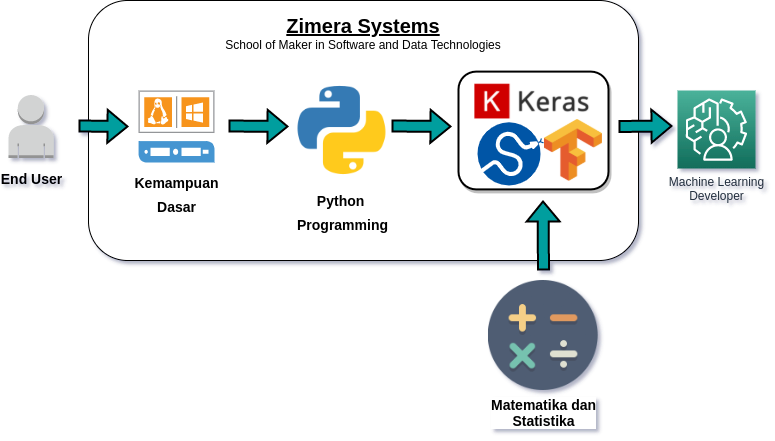

# Materi Pembelajaran "Python Programming for Artificial Intelligence - Machine Learning"

## Prasyarat:

1. [Kemampuan Dasar](../kemampuan-dasar.md)
2. [Python Programming](../python-programming/)
3. Matematika dan Statistika, lihat di bawah.

## Matematika dan Statistika untuk AI

Pemrograman AI menggunakan Python melibatkan berbagai macam algoritma serta pemahaman berbagai materi matematika serta statistika. Bagian ini merupakan bagian yang harus dipahami sebagai dasar dari bekerjanya berbagai sistem AI. Secara umum, materi yang diperlukan adalah:

1. Statistika
2. Probabilitas
3. Aljabar Linear
4. Optimisasi
5. Kalkulus

Siswa diharapkan sudah mempunyai dasar pemahaman terhadap materi di atas atau bersedia utk mempelajari dan me-review materi-materi di atas. Jika memerlukan *resources*, silahkan melihat berbagai materi berikut:

1. [Pertanyaan Quora tentang *How do I learn mathematics for machine learning?*](https://www.quora.com/How-do-I-learn-mathematics-for-machine-learning)
2. [Mathematics for Data Science](https://towardsdatascience.com/mathematics-for-data-science-e53939ee8306)
3. [Math, Stats and NLP for Machine Learning: As Fast As Possible](https://medium.com/meta-design-ideas/math-stats-and-nlp-for-machine-learning-as-fast-as-possible-915ef47ced5f)

## Pustaka Esensial untuk Machine Learning (ML)

Untuk memahami ML, selain memerlukan pemahaman dasar-dasar matematika dan statistika seperti di atas, diperlukan juga pemahaman berbagai malam pustaka dasar dari Python yang digunakan untuk keperluan mulai dari penyiapan data, presentasi data (dalam bentuk visual), serta proses ML itu sendiri. Materi tentang ML akan dimulai dari berbagai pustaka yang diperlukan untuk dasar-dasar pemrograman ML menggunakan Python:

1. [NumPy](https://numpy.org/): pustaka untuk pengolahan matriks, array dengan N-dimensi, serta berbagai fungsi yang terkait dengan aljabar linear, transformasi Fourier, serta angka acak (*random*).
2. Visualisasi data menggunakan [Matplotlib](https://matplotlib.org/). Jika menginginkan fasiltas yang lebih banyak, bisa mempelajari [Seaborn](https://seaborn.pydata.org/index.html).
3. [SciPy](https://scipy.org/scipylib/index.html): pustaka untuk komputasi ilmiah - integrasi numerik, interpolasi, optimisasi, aljabar linear, dan statistika.
4. [Pandas](https://pandas.pydata.org/): untuk eksporasi dan penyiapan data.
5. [Statsmodel](http://www.statsmodels.org/stable/index.html): pustaka dengan fondasi NumPy dan SciPy yang menyediakan berbagai kelas dan fungsi untuk keperluan estimasi berbagai model statistika, melaksanakan uji statistika, serta eksplorasi data statistika.

## Materi *Python Programming for Artificial Intelligence - Machine Learning*

[Minggu 01](isi/01.md)

*Hari 1: Komputasi Numerik Menggunakan NumPy*

1. Instalasi NumPy
2. Ruang lingkup komputasi numerik di NumPy
3. Pengolahan array di NumPy menggunnakan **ndarray**
4. Matriks dan Vektor di NumPy
5. Aljabar Linear 

*Hari 2: Visualisasi Data Menggunakan Matplotlib*

1. Instalasi Matplotlib
2. Ruang lingkup visualisasi data menggunakan Matplotlib
3. Tipe Dasar Plot di Matplotlib
4. Matplotlib lanjut

*Hari 3: Komputasi Ilmiah Menggunakan SciPy*

1. Instalasi SciPy
2. Ruang lingkup SciPy
3. NumPy vs Scipy
4. Penggunaan Fungsi-fungsi Dasar SciPy

*Hari 4: Eksplorasi dan Penyiapan Data Menggunakan Pandas*

1. Instalasi Pandas
2. Ruang lingkup Pandas
3. Ekosistem Pandas
4. Struktur data dan fungsionalitas dasar dari Pandas
5. Penggunaan Pandas untuk penyiapan data

*Hari 5: Model dan Analisis Statistika Menggunakan Statsmodels*

1. Instalasi Statsmodels
2. Ruang lingkup Statsmodels
3. Konsep dan dasar Statsmodels
4. Data dan datasets
5. Regresi Linier

**Catatan**

Pembelajaran terkait pustaka esensial ini sebenarnya relatif banyak. Materi-materi yang ada pada minggu ini merupakan materi yang lebih bersifat pada pengenalan dan pemahaman ruang lingkup. Untuk pembelajaran lebih lanjut, beberapa sumber daya berikut ini bisa digunakan:

1. [Scipy Lecture Notes](https://scipy-lectures.org/)
2. [From Python to NumPy](https://www.labri.fr/perso/nrougier/from-python-to-numpy/), juga [repo GitHub](https://github.com/rougier/from-python-to-numpy).
3. [SciPy Cookbook](https://scipy-cookbook.readthedocs.io/).
4. [Materi setelah *Basic Documentation* untuk **statsmodel**](https://www.statsmodels.org/stable/index.html).

### Machine Learning dan Deep Learning 

[Minggu 02](isi/02.md)

*Hari 1: Datasets untuk Machine Learning*

1. Pengertian datasets
2. Datasets yang telah tersedia
3. Mengelola datasets

*Hari 2: Pengenalan Machine Learning dan Scikit Learn*

1. AI, Machine Learning dan ruang lingkupnya
2. Instalasi scikit-learn
3. Pengenalan problem Machine Learning: *supervised learning*

*Hari 3:*

*Hari 4:*

*Hari 5:*

[Minggu 03](isi/03.md)

*Hari 1:*

*Hari 2:*

*Hari 3:*

*Hari 4:*

*Hari 5:*

